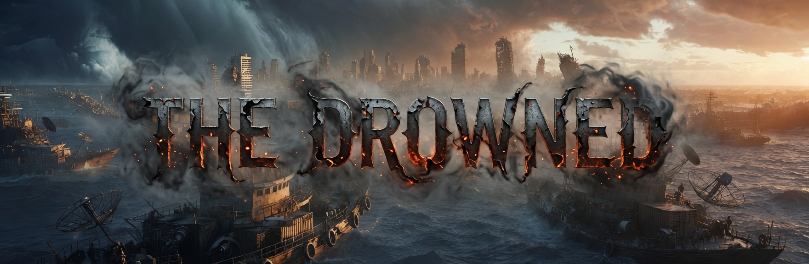

# Drowned World

<table align="center">
  <tr>
    <td align="center" valign="middle">
      
    </td>
    <td align="center" valign="middle" width="220">
      <a href="https://ko-fi.com/laughinginpurgatory">
        
      </a>
      <br/><br/>
      Please support me on KOFI, every bit helps!
    </td>
  </tr>
</table>

<p align="center">
  <strong>A procedurally generated open-world ocean trading and combat game</strong><br/>
  Electron + Three.js · one seamless sea · arcade boat handling · saves & berths
</p>

<p align="center">
  <a href="https://github.com/LaughingInPurgatory/drowned-world/releases/latest"></a>
</p>

---

The seas rose after the war. What is left is water, a scatter of islands, and whatever people have nailed together on top of them.

A desktop ocean sim on **one seamless sea 80 km across** — ~170 islands, harbours, sea forts and sunken wreck fields, **100+** vessel classes (including salvage-only Drowned hulls), real-time boat handling and gunnery, harbour workshops, local security and law standing, saves, and crew berths. No loading screens: the whole world is one coordinate space you can sail across.

New Game starts you alongside at **Port Haven** on **Haven Reach** — the middle of the sea, the last harbour with a working harbourmaster, always **Security 6**.

> **Saves:** save files from the space-era builds will **not** load. Start a **New Game**.

## Features

- **One seamless sea** — a fixed canonical seed builds the same 80 km world for every player: archipelagos, coastal harbours, floating rigs, sea forts, and sunken wreck fields. No regions, no jumps, no loading seam. Home is always **Haven Reach**.
- **It's a real sea** — a summed swell drives both the water you can see and the water your hull sits on, from one shared wave field. Boats pitch, roll and heave with it; whitecaps break on the steep faces; the sun lays a track across it.
- **Boat handling** — rudder, throttle and side thrusters, not a flight stick. The rudder bites harder with way on but still works stopped; A/D crab the hull sideways so you can put it on a quay. Hulls heel into a turn, trim bow-up under power, carry way off the throttle, and slide sideways for about a second before the water stops them.
- **Autopilot (C)** — hand the helm over and it comes round onto your waypoint, holds the course, **steers around islands**, and eases off as it closes. About 1.5× a hand-steered passage: enough that you are not holding W across an ocean, not so much that the sea stops mattering.
- **Day and night** — a full cycle every 25 minutes. The sun tracks across, the sky and the sea change colour with it, dawn and dusk burn along the horizon, and the stars come out. Harbour lamps and mast lights carry the night.
- **Weather overhead** — a drifting procedural cloud deck, lit from the sun side, thickening toward the horizon the way real cloud does.
- **How far out you are is the difficulty curve** — Haven Reach is policed and picked over. The further you sail, the worse the law, the harder the raiders, and the better the salvage still lying on the bottom.
- **Local security** — every harbour has its own rating **0–6** and patrols the water around it. Between them is open sea, which answers to nobody. **Law standing 0–10** (start 10): attacking honest traffic only costs you where someone is watching. Low standing draws patrols, refused berths, and eventually shoot-on-sight.
- **100+ vessel classes** — hulls lofted from station lines with transom, sheer and freeboard, round bilge or hard chine, then fitted out: deck, wheelhouse, bridge windows, funnel, mast and rigging, railings, fenders, anchor and bollards. What sits on the deck is the trade — deck cargo and a crane on a freighter, a gun tub and ammo lockers on a gunboat, davits and a survey winch on an explorer, an A-frame and a dive platform on a salvage boat.
- **Islands with shapes** — six landforms (dome, ridge, mesa, sea stack, atoll with a lagoon, scattered cluster) crossed with five materials (bare rock, scrub, drowned town, pre-war works, fresh basalt). Coloured by height, slope and tide line, with talus at the foot and ruins on the high ground where someone used to live.
- **The Drowned** — pre-war military hulls and ordnance, never sold anywhere. The only way to get them is to salvage an extremely rare blueprint off a sunken warship and build it yourself.
- **Salvage diving** — work sunken hulls with your deck guns for material; finite yield per hulk, better grades further out, and stripped fields settle again on the campaign clock. In **Security 0–3** there is a **10%** chance per hit of attracting raiders.
- **Gunnery** — **LMB** fires every gun mount, **RMB** every launcher — deck guns, autocannon and catapults on one, harpoons, torpedoes and depth charges on the other; armour and hull, and nothing grows back; boats that circle, break off when hit, run when beaten, and occasionally ram. Raiders may call a truce with you against the Drowned.
- **Bounties** — sinking a hostile pays a random credit bounty, higher in lawless water, plus whatever floats up out of the wreck.
- **Escorts** — hulls with davits can carry launched RIBs; buy at **Boatyard → Armoury**, launch (**G**), recall (**H**). They engage only once shots are exchanged.
- **Sonar drone** — sound islands and wreck fields for survey data, classification reports, and rare blueprints. Auto-returns after the scan.
- **Contracts** — bounty, charting, signal, survey and haulage work, priced by distance over the water. Half of every board is short work close to home. Objectives auto-complete in the field.
- **Trading economy** — tag-driven prices and per-harbour stock. Home waters are awash with scrap and short of anything rare; the deep is the other way round. Buy and sell through **harbour storage** (you move it to the boat yourself).
- **Harbours** — every one is generated: quay on piles, finger jetties, warehouses, fuel tanks, gantry cranes, a harbourmaster's tower, a rubble mole and lamps down the quay. Come alongside into a walkable interior; per-harbour cargo, salvage, parts, laid-up boats, weapons, accessories, blueprints. Every harbour has a boatyard; outposts do repairs only.
- **Workshop** — rare blueprints from wrecks and soundings (one-shot, not sellable); build boats, weapons and accessories from stored salvage. Jobs run on wall-clock time and keep working while you are away.
- **Skills & skillbooks** — **0–20** per skill, loot-only books from wrecks.
- **Wall-clock campaign time** — offline catch-up on load, so wreck fields settle and workshop jobs finish while the game is closed.
- **Chase camera** — astern and low, riding a smoothed waterline so it does not bob with every crest, and level however hard the boat heels. **Hold Alt + mouse** to look around.
- **HUD** — velocity and shield/armour/hull up top, heading-up radar below, contacts list to the right, **sea chart (M)** and **sounding (B)** as movable floating panels.
- **Music & SFX** — title, ambient and death music; sampled engines, guns and dock, plus synthesised combat layers. Separate **Sound Effects** and **Music** toggles in **Settings**.
- **UI Colour** — retint accent and panel background in **Settings → UI Colour**; applies live and saves.
- **Windowed app + fullscreen** — default windowed with OS frame (**1600×900**, size/position remembered). **Alt + Enter** toggles fullscreen.
- **Saves & berths** — manual/quick save; death screen names what sank you. **Berths** at many harbours let you keep a body backup.

## Getting started

```
npm install
npm run dev
```

Launches the app with hot module reloading. Editing `src/renderer/main.js` while `npm run dev` is running resets the current game to the main menu — expected.

### Building

```
npm run build     # electron-vite build
npm run package   # build + electron-builder --dir (unpacked)
npm run make      # build + electron-builder (macOS arm64 DMG, unsigned)
```

Artifacts land in `release/` (e.g. `release/mac-arm64/Drowned World.app`). `.blockmap` files are for remote auto-update deltas and can be deleted for local testing.

Prebuilt builds (macOS arm64, unsigned) are on the [Releases](https://github.com/LaughingInPurgatory/drowned-world/releases) page. Pushing a `v*` tag — or running the **Release** workflow — runs the tests, builds the DMG on GitHub Actions and attaches it (`.github/workflows/release.yml`). Other platforms are a commented matrix at the bottom of that file.

The build is unsigned, so macOS quarantines it on first open: right-click → Open, or `xattr -dr com.apple.quarantine "/Applications/Drowned World.app"`.

### Testing

Tests use Node’s built-in runner, colocated as `*.test.js`:

```
node --test src/renderer/game/*.test.js src/renderer/procgen/*.test.js src/renderer/data/*.test.js
node --test src/renderer/game/combat.test.js
```

## Controls

You take the helm with **Space**. While you have the helm the pointer is locked for steering; open a panel or press Space again for a normal cursor. After alt-tab, click the canvas or press Space to take it back. **Settings → Controls** (intro menu or pause) matches these bindings.

| Input | Action |
| --- | --- |
| **Space** | Take / leave the helm |
| **Mouse movement** | Rudder — steers even at a standstill |
| **Alt + mouse** | Free-look around the boat (release Alt to restore the chase seat) |
| **Alt + Enter** | Toggle fullscreen |
| **Left click** | Fire all guns (can hold with RMB) |
| **Right click** | Fire all launchers (can hold with LMB) |
| **W / S** | Ahead / astern (coasts down when released; astern capped at 25% of ahead) |
| **S** | While alongside: open/close **Services** |
| **A / D** | Crab sideways to port / starboard — works stopped, for coming alongside |
| **Tab** | Target under crosshair, or cycle nearby contacts |
| **Shift+Tab** | Clear target lock |
| **Backspace** | Clear target lock |
| **Ctrl/Cmd + Tab** | Set waypoint on whatever is under the crosshair |
| **C** | Toggle open-sea cruise (requires a waypoint) |
| **M** | Sea chart |
| **B** | Sounding (or click the region chip) |
| **F** | Use targeted contact: salvage wreck · come alongside · crack a datacore nodule |
| **P** | Launch / recover the sonar drone |
| **G** | Launch support drones (requires drones in the bays) |
| **H** | Recall support drones |
| **I** | Hold |
| **J** | Contracts |
| **F1** | Character sheet |
| **Esc** | Pause (Resume to continue; dismisses open panels) |
| **F5** | Hail locked target (flavour dialogue) |
| **Free mouse** | Click the contacts list (right) to set waypoints |

There is no roll, no pitch and no vertical thrust — a boat has a rudder, a throttle, and thrusters to shove it sideways onto a berth.

Main menu and pause menu both open **Settings**: **Sound Effects**, **Music**, **UI Colour** (accent + panel background), and **Controls**. Preferences are saved for the next launch.

## Tech stack

- [Electron](https://www.electronjs.org/) (`electron-vite`, `electron-builder`)
- [Three.js](https://threejs.org/) for 3D
- Plain DOM for HUD, menus, and harbour UI (in-game dialogs via `gameDialog.js` — no `window.alert`/`prompt`)
- Node’s built-in test runner (`node:test`)
- SFX samples: [Kenney Sci-Fi Sounds](https://kenney.nl/assets/sci-fi-sounds) (CC0)
- Hull, rock and vegetation PBR textures: [ambientCG](https://ambientcg.com/) (CC0)
- Harbour and interior kit pieces: [Kenney](https://kenney.nl/) (CC0); selected props from [Quaternius](https://quaternius.com/) (CC0)

## License / credit

© Laughing In Purgatory 2026
